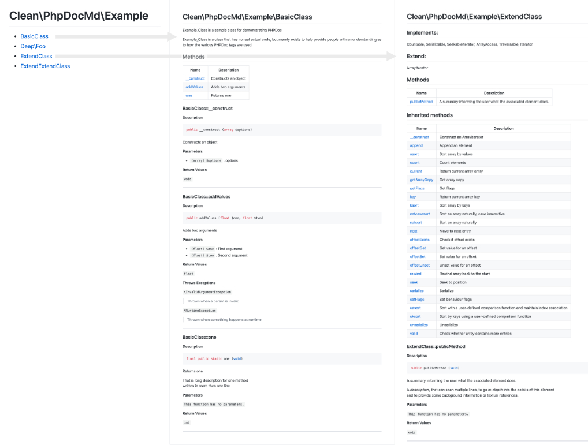

# clean/phpdoc-md

[](https://travis-ci.org/clean/phpdoc-md)
[](https://codeclimate.com/github/clean/phpdoc-md)
[](https://codeclimate.com/github/clean/phpdoc-md/coverage)
[](https://codeclimate.com/github/clean/phpdoc-md)
[](https://packagist.org/packages/clean/phpdoc-md)
[](https://packagist.org/packages/clean/phpdoc-md)
[](https://packagist.org/packages/clean/phpdoc-md)



phpdoc-md is a tool to generate nicely looking documentation from PHPDOC comments.

It allows to generate documentation markdown files easy to read and follow 
directly on github, gitlab or bitbucket sites.

You can see an example documentation generated by this tool in [here](docs/README.md)

The intention of this tool is little bit different then standard PHPDocumentator.
It focus on class instances and generates documentation from public methods at first place.
Whenever class inherits from some other class the full interface from parent and child will be presented
as part of it but inherited methods will be placed in separate section. 

## How to use it?

phpdoc-md is configured via single (php format) `.phpdoc-md` file located in
your project root directory.

Example of `.phpdoc-md` file:

```
<?php
return (object)[
    'rootNamespace' => 'Clean\PhpDocMd\Example', 
    'destDirectory' => 'docs',
    'format' => 'github',
    'classes' => [
        '\Clean\PhpDocMd\Example\Basic',
        '\Clean\PhpDocMd\Example\Deep\Foo',
        '\Clean\PhpDocMd\Example\ExtendClass',
        '\Clean\PhpDocMd\Example\ExtendExtendClass',
    ],
];
```
